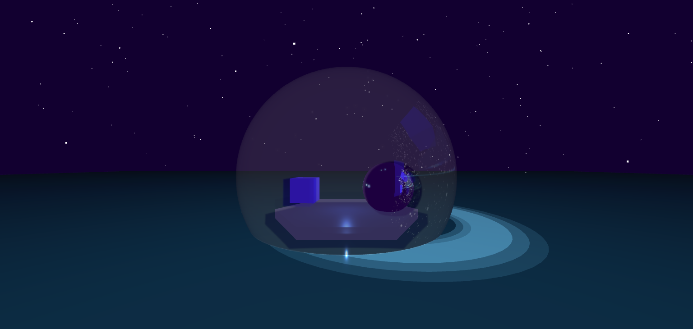

# Night Scene with Stars and Reflections



This is a visual scene built using [Three.js](https://threejs.org/), featuring a starry night sky, a reflective blue water surface, dynamic ripples, and glowing sci-fi elements.


---

## 🚀 Features

- **800 animated stars**: Simulates a natural sky with stars that gently twinkle over time.
- **Star reflections on water**: Faint, soft reflections of stars appear on the water using mirrored geometry and blended materials.
- **Reflective transparent water surface**: The water is created using a physical material for realistic gloss and transparency.
- **Futuristic platform with reflective and glowing elements**: Includes a reflective sphere, glowing cube, and a transparent dome.
- **Animated ripples**: Ripple effects spread dynamically across the water surface.
- **Soft lighting**: Combines ambient, directional, point, and spot lights for a subtle and atmospheric glow.

---

## 🛠 Technologies Used

- **Three.js** (WebGL library)
- Core objects:
  - `PerspectiveCamera`, `Points`, `Mesh`, `Lights`, `CubeCamera`, `WebGLCubeRenderTarget`
- Materials:
  - `MeshPhysicalMaterial` (for water, dome)
  - `MeshStandardMaterial` (for objects)
  - `PointsMaterial` (for stars and reflections)
  - `MeshBasicMaterial` (for ripples and surface glow)
- Animation:
  - `Clock` and `requestAnimationFrame`

---

## ✨ Key Implementations

### Star Field and Reflections
```js
// Star geometry
const stars = new THREE.BufferGeometry();
// Reflected stars (mirror Y-axis and apply faint blending)
const reflectedStars = new THREE.BufferGeometry();
